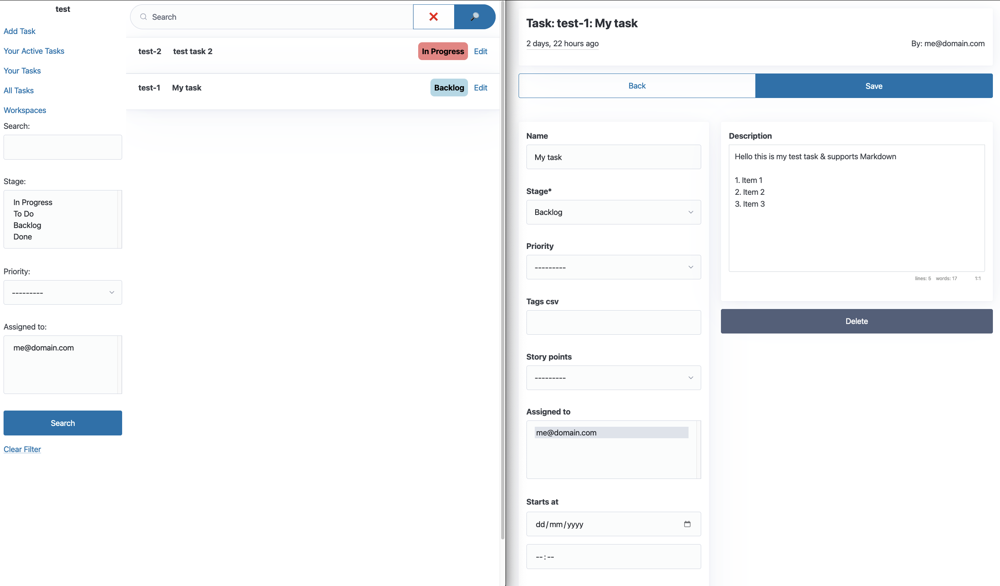

# Django-Nonlinear

## Manage your Django project inside your Django project





Overview
========

[Django-Nonlinear](https://github.com/fxadecimal/django-nonlinear) is inspired by [linear.app](https://linear.app).


Nonlinear tries it's best to get out of your way so you can focus on building the product & not managing the tool.

It has 2 main use-cases:

- Small or low-cost projects
- Privacy or Regulatory compliance


Features
========


- Git branch name generator e.g. `workspace-1_create-gpt-5`
- Draggable task list (Sortable / HTMX)
- Multiple Workspaces supported
- Markdown Support
- Task Exporter Command: `./manage.py nonlinear_dump workspace_slug`


Quick Start: Run Sample Project
===============================


Either, install with pip:

```sh
pip install git+https://github.com/fxadecimal/django-nonlinear.git
```

Or, add to your `requirements.txt`:

```sh
# requirements.txt
git+https://github.com/fxadecimal/django-nonlinear.git
```

Or, clone the repo directly:

```sh
git clone git@github.com:fxadecimal/django-nonlinear.git
cd django-nonlinear/sample_project
```

Finally, migrate and run your server:

```sh
# Run test server
./manage.py migrate --noinput
./manage.py runserver
```

Create a new workspace & add yourself:

- [http://localhost:8000/admin/nonlinear/workspace/](http://localhost:8000/admin/nonlinear/workspace/)


Quick Start: Add to an existing Project:
========================================

```sh
# using your python environment
git clone git@github.com:fxadecimal/django-nonlinear.git
pip install ./django-nonlinear
```

Add dependencies to Django `settings.py`:

```py
INSTALLED_APPS = [
    ...
    "django.contrib.humanize",
    "markdownify.apps.MarkdownifyConfig",
    "crispy_forms",
    "crispy_bootstrap5",
    "django_filters",
    "nonlinear",
]
```

Add to Django `urls.py`:

```py
from django.contrib import admin
from django.urls import path, include

urlpatterns = [
    path("admin/", admin.site.urls),
    path("nonlinear/", include("nonlinear.urls")),
]
```

Migrate Nonlinear:

```sh
./manage.py migrate nonlinear
```

(optional) Collect Static: `./manage.py collectstatic`


Quickstart: Docker-compose
==========================

```sh
docker-compose up --build
docker-compose exec web python manage.py migrate
docker-compose exec web python manage.py createsuperuser
```


Planned Features
================

- User Comments
- Task Activity
- Project View
- Calendar View
- User Centric Lists
- Rest API


References
==========

- [Nearbeach](https://github.com/nearbeach/NearBeach/)
- [django-countries](https://github.com/SmileyChris/django-countries)
- [djangox](https://github.com/wsvincent/djangox)